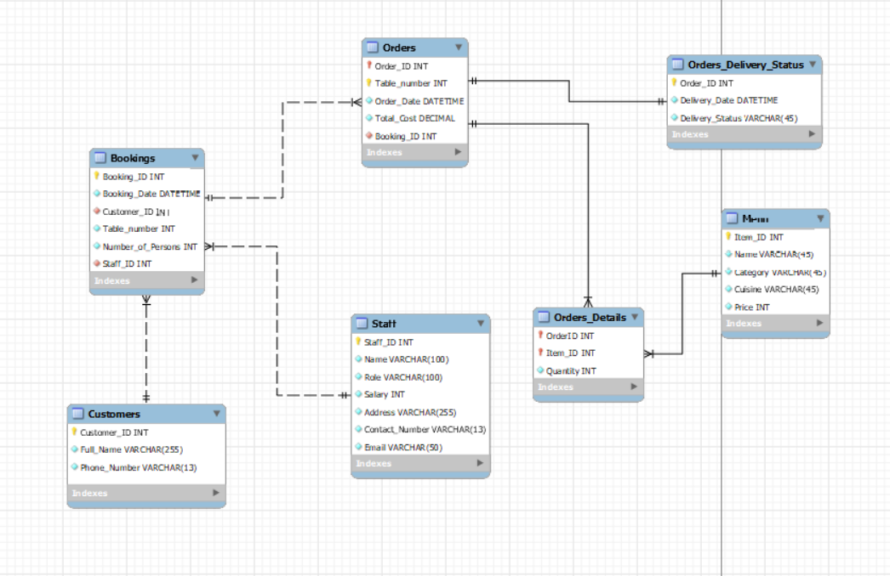

> This documentation is for issue #1.

# The information required to be stored in this database #

1. Bookings: To store information about booked tables in the restaurant including booking id, date and table number.

2. Orders: To store information about each order such as order date, quantity and total cost.

3. Order delivery status: To store information about the delivery status of each order such as delivery date and status.

4. Menu: To store information about cuisines, starters, courses, drinks and desserts.

5. Customer details: To store information about the customer names and contact details.

6. Staff information: Including role and salary.

# Main entites and related attributes #

* Customers:
   * PK &rarr; Customer ID
   * Attributes &rarr; Full Name - Phone Number

* Staff:
   * PK &rarr; Staff ID
   * Attributes &rarr; Name - Role - Salary - Address - Contact Number - Email

* Mene Items:
  * PK &rarr; Item ID
  * Attributes &rarr; Item name - Category - Cuisine - Price

* Bookings:
  * PK &rarr; Booking ID
  * Attributes &rarr; Booking date - Customer - Table number - Number of Persons - Staff

* Orders:
  * PK &rarr; Order ID
  * Attributes &rarr; Table number - Order date - Total cost - Booking ID - Items and Quantity

* Orders Delivery Status:
  * PK &rarr; Order ID
  * Attributes &rarr; Order ID - Delivery Date - Delivery Status

# Normalization Process #

* The tables Orders have multi-valued attrbiutes such as Items and Quantities
* The solution is to split this table into 2 tables:
    1. Orders &rarr; The original table without the items and quantity
    2. Orders_Details
        * PK &rarr; Order ID & Item ID
        * Attributes &rarr; Quantity

# Final Desgin of the Database #

This design was implemented using MySQL Workbench tool.

